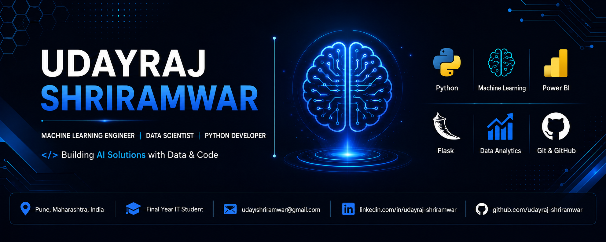

  

<h1 align="center">👋 Hi, I'm Udayraj Shriramwar</h1>

<b>Building AI Solutions with Data & Code</b>

---

# 🧠 AI Developer Dashboard 

| 👨‍💻 Profile | 🚀 Current Focus |
|---------------|------------------|
| **🎓 Education** Final Year B.E. Information Technology | 🌾 Farm Performance & Forecasting |
| **📍 Location** Pune, Maharashtra, India | 🤖 Machine Learning |
| **💼 Looking For** Software Development & Data Science Roles | 🐍 Python Development |
| **🟢 Status** Open to Internship & Full-Time Opportunities | 📊 Power BI & Data Analytics |
| **💡 Interests** AI • ML • Data Science • Software Engineering | 🌐 Flask & Model Deployment |

---

## 👨‍💻 About Me

- 🎓 Final Year Information Technology Student
- 🌱 Currently learning **Advanced Machine Learning, Flask & Model Deployment**
- 🤖 Interested in **Machine Learning, Artificial Intelligence & Data Science**
- 💻 Building real-world ML applications using Python and Flask
- 📊 Love turning data into meaningful insights with Power BI
- 🚀 Looking for Software Development & Data Science opportunities

# 🛠️ Tech Stack

### 💻 Programming Languages

### 🤖 Machine Learning & Data Science

### 🌐 Frameworks & Libraries

### 🛠️ Tools & Platforms

---

# 📊 GitHub Analytics

  
  

  

---

# 🤝 Let's Connect

